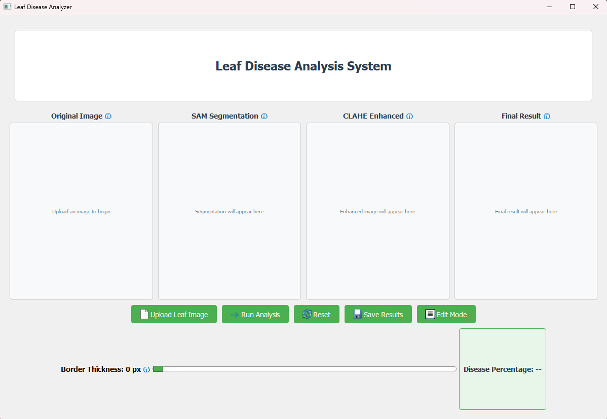
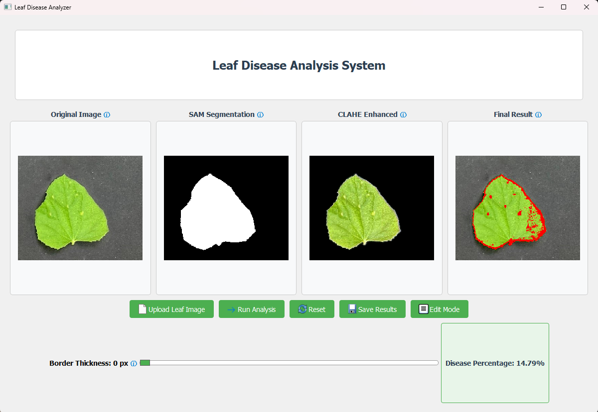
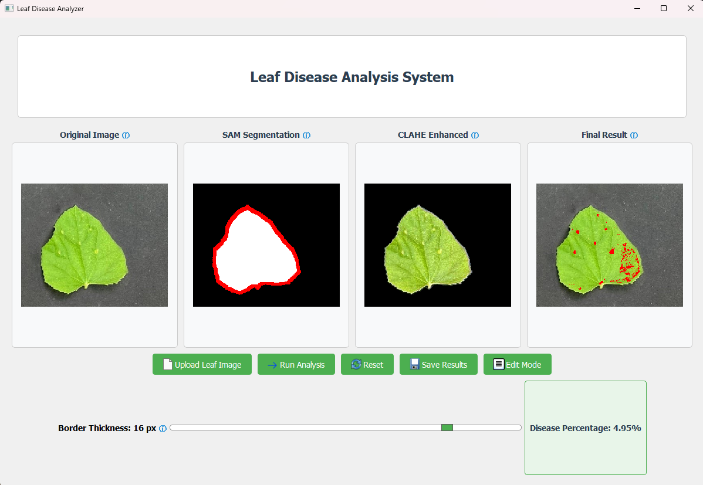
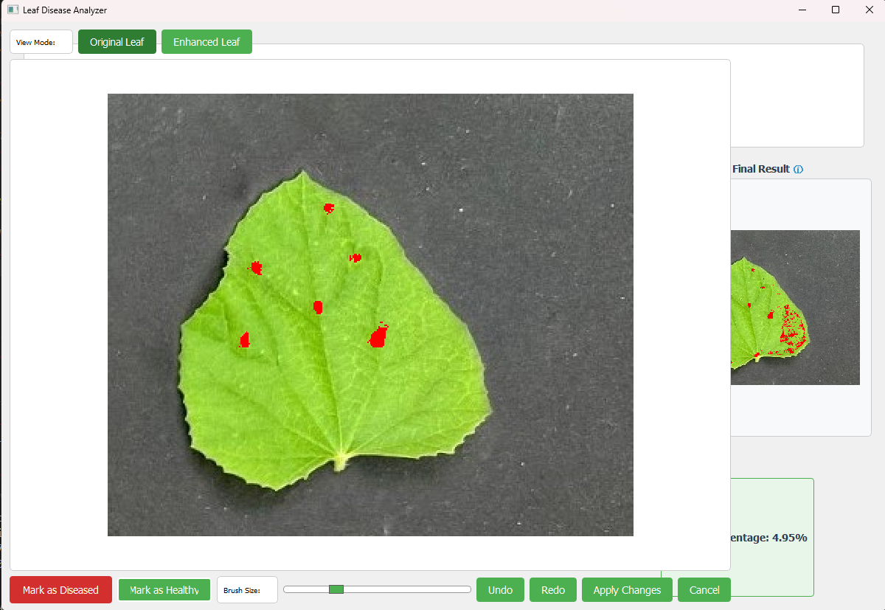

# Melon Leaf Disease Detector

A machine learning-based system for detecting and classifying diseases in melon leaves using computer vision and machine learning techniques.

## Overview

This project provides a comprehensive solution for detecting and classifying diseases in melon leaves. It combines computer vision techniques with machine learning models to analyze leaf images and identify signs of disease. The system includes both a graphical user interface for easy interaction and a robust backend for image processing and classification.

## Features

- **Image Processing Pipeline**:
  - CLAHE (Contrast Limited Adaptive Histogram Equalization) for enhanced leaf visibility
  - SAM (Segment Anything Model) for precise leaf segmentation
  - HSV color space conversion for better feature extraction

- **Machine Learning Models**:
  - Multiple classifier options (Logistic Regression, Random Forest)
  - Balanced dataset training to handle class imbalance
  - Hyperparameter tuning via GridSearchCV
  - Comprehensive model evaluation with confusion matrices

- **User Interface**:
  - Intuitive GUI for image upload and processing
  - Real-time visualization of processing steps
  - Detailed classification results display
  - Interactive editing capabilities

## GUI Interface

The system provides a user-friendly interface for leaf disease detection with interactive features. Here's how it works:

### 1. Image Upload and Initial View

- Users can upload melon leaf images through a simple file dialog
- The original image is displayed in the main window
- Clear instructions guide users through the process

### 2. Multi-View Analysis

- The interface displays four key views simultaneously:
  - Original image
  - CLAHE enhanced image
  - SAM segmentation mask
  - Final classification result
- This comprehensive view allows users to understand each step of the analysis

### 3. Interactive Segmentation Controls

- Users can adjust the border thickness of the segmentation mask
- The "Rerun Analysis" button allows recalculation with new parameters
- Disease percentage updates dynamically based on the new segmentation
- Real-time feedback on how parameter changes affect the results

### 4. Result Editing and Recalculation

- The edit screen allows manual adjustment of the classification results
- Users can modify the segmentation mask to focus on specific areas
- The system recalculates the disease percentage based on user edits
- This interactive approach enables fine-tuning of the analysis

## Installation

### Prerequisites

- Python 3.8+
- PyQt5
- OpenCV
- scikit-learn
- pandas
- numpy
- matplotlib
- seaborn
- Segment Anything Model (SAM)

### Setup

1. Clone the repository:
   ```
   git clone https://github.com/yourusername/Melon-Leaf-Detector.git
   cd Melon-Leaf-Detector
   ```

2. Install dependencies:
   ```
   pip install -r requirements.txt
   ```

3. Download the SAM model checkpoint:
   - Download `sam_vit_b.pth` from [Meta AI's SAM repository](https://github.com/facebookresearch/segment-anything)
   - Place it in the `checkpoints` directory

## Usage

### Training Models

To train the classification models with balanced dataset:

```
python train.py
```

This will:
- Load and preprocess the dataset
- Balance the training data by downsampling the majority class
- Train and tune multiple models
- Evaluate models and save the best one
- Generate confusion matrices in the `outputs` directory

### Running the GUI

To launch the graphical user interface:

```
python gui.py
```

The GUI allows you to:
1. Upload leaf images
2. Process images with CLAHE and SAM
3. Adjust segmentation parameters and rerun analysis
4. Edit results and recalculate disease percentage
5. View detailed results and visualizations

## Project Structure

```
Melon-Leaf-Detector/
├── data/                  # All data files
│   ├── raw/              # Original leaf images
│   └── processed/        # Processed data
│       ├── clahe/       # CLAHE processed images
│       └── pixel_dataset_rgbhsv.csv
├── checkpoints/          # Model checkpoints (SAM)
├── images/              # GUI documentation images
├── models/              # Trained classification models
├── outputs/             # Evaluation results and visualizations
├── src/                 # Source code
│   ├── modeling/        # Model training and evaluation
│   └── preprocessing/   # Image preprocessing utilities
├── gui.py              # Graphical user interface
├── train.py            # Model training script
├── LICENSE             # MIT License
└── requirements.txt    # Project dependencies
```

## Data

The system uses a dataset of melon leaf images with the following features:
- RGB color channels
- HSV color space conversion
- Balanced training data to handle class imbalance

## Model Performance

The models are evaluated using:
- Accuracy
- Confusion matrices
- Classification reports

Results are saved in the `outputs` directory after training.

## License

This project is licensed under the MIT License - see the [LICENSE](LICENSE) file for details.

## Acknowledgments

- Meta AI for the Segment Anything Model (SAM)
- Roni Burdam and Yael Sznaidman, my project partners at Ben Gurion University's Image Processing and Analysis course
- This project originated as a course assignment and was later extended with:
  - Integration of the SAM model for improved segmentation
  - Enhanced GUI with interactive features
  - Additional model training and evaluation capabilities
